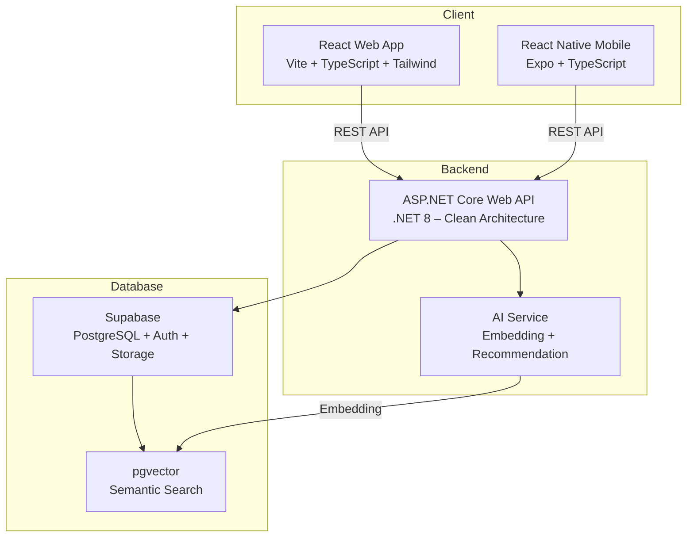

# 📚 SmartLibrary – Hệ thống quản lý thư viện thông minh

> Đồ án tốt nghiệp – Hệ thống quản lý thư viện tích hợp AI gợi ý sách theo nhu cầu người đọc.

## 🏗️ Kiến trúc hệ thống



## 📁 Cấu trúc Monorepo

```
SmartLibrary-FPT/
├── apps/
│   ├── web/        → React + Vite + TypeScript + TailwindCSS
│   ├── mobile/     → React Native (Expo) + TypeScript
│   └── api/        → .NET 8 ASP.NET Core Web API (Clean Architecture)
├── supabase/       → Migrations, seed data, config
├── docs/           → Tài liệu kiến trúc, API, sơ đồ
├── deploy/         → Docker, Nginx, scripts
└── .github/        → CI/CD workflows, templates
```

## 🚀 Cách chạy local

### Yêu cầu

| Tool | Version |
|---|---|
| Node.js | >= 20.x |
| .NET SDK | 8.0 |
| Docker | >= 24.x |
| Supabase CLI | >= 1.x |

### 1. Backend API

```bash
cd apps/api
dotnet restore
dotnet build
dotnet run --project src/SmartLibrary.Api
# API chạy tại: https://localhost:5001
# Swagger: https://localhost:5001/swagger
# Health check: https://localhost:5001/health
```

### 2. Web App

```bash
cd apps/web
npm install
cp .env.example .env.local
# Sửa biến môi trường trong .env.local
npm run dev
# Web chạy tại: http://localhost:5173
```

### 3. Mobile App

```bash
cd apps/mobile
npm install
cp .env.example .env.local
npx expo start
# Scan QR code bằng Expo Go
```

### 4. Supabase (Local)

```bash
supabase start
supabase db reset   # Apply migrations + seed data
```

## 🔑 Biến môi trường

| Biến | Mô tả | Dùng ở |
|---|---|---|
| `VITE_API_URL` | URL backend API | Web |
| `VITE_SUPABASE_URL` | Supabase project URL | Web |
| `VITE_SUPABASE_ANON_KEY` | Supabase anon key | Web |
| `EXPO_PUBLIC_API_URL` | URL backend API | Mobile |
| `EXPO_PUBLIC_SUPABASE_URL` | Supabase project URL | Mobile |
| `EXPO_PUBLIC_SUPABASE_ANON_KEY` | Supabase anon key | Mobile |
| `ConnectionStrings__DefaultConnection` | PostgreSQL connection string | API |
| `Jwt__Secret` | JWT signing secret (Supabase) | API |
| `Supabase__Url` | Supabase URL | API |
| `Supabase__ServiceRoleKey` | Supabase service role key | API |

> ⚠️ **Không commit file `.env`!** Chỉ commit `.env.example`.

## 👥 Vai trò người dùng

| Vai trò | Mô tả |
|---|---|
| **Reader** | Sinh viên – mượn sách, đánh giá, nhận gợi ý AI |
| **Librarian** | Thủ thư – quản lý sách, xử lý mượn/trả, phạt |
| **Admin** | Quản trị – quản lý hệ thống, thống kê, cấu hình |

## 📐 Quy ước đặt tên

| Ngôn ngữ | Convention | Ví dụ |
|---|---|---|
| C# class/method | PascalCase | `BookService`, `GetAllAsync` |
| C# biến/param | camelCase | `bookId`, `pageSize` |
| TypeScript biến/hàm | camelCase | `fetchBooks`, `isLoading` |
| React component | PascalCase | `BookCard`, `LoginForm` |
| File TS/TSX | kebab-case | `book-card.tsx`, `use-books.ts` |
| CSS class | kebab-case | `book-card`, `sidebar-nav` |
| API endpoint | kebab-case | `/api/v1/books`, `/api/v1/borrow-records` |
| Database | snake_case | `book_copies`, `borrow_records` |

## 🌿 Git Flow

Chi tiết tại [CONTRIBUTING.md](./CONTRIBUTING.md).

```
main          ← production (protected)
develop       ← integration
feature/*     ← feature branches
hotfix/*      ← hotfix branches
release/*     ← release branches
```

## 📄 License

[MIT](./LICENSE)
