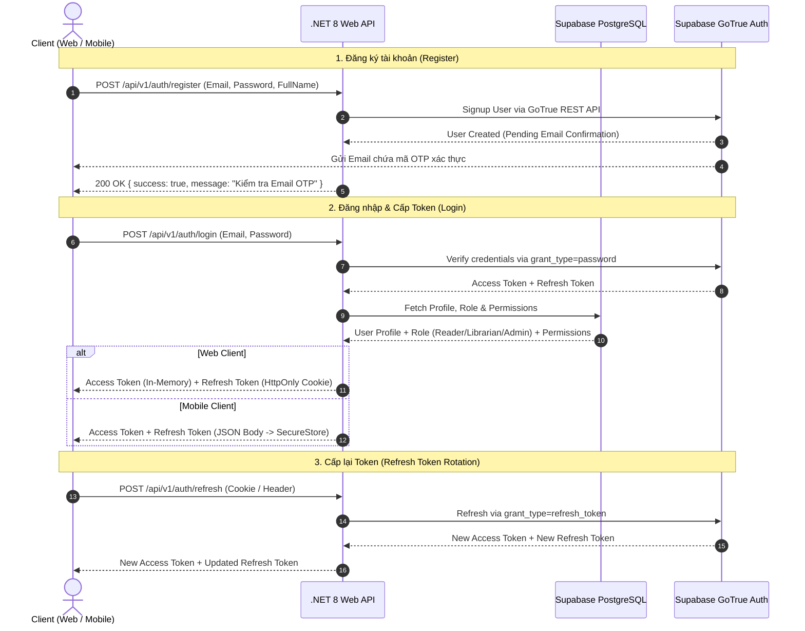

# SmartLibrary - Architecture & Authentication Specification

## 1. Authentication Architecture Overview

SmartLibrary uses **Supabase Auth** as the primary Identity Provider (IdP) for securely managing user identities, hashing passwords, issuing JWT tokens, and handling email verification/password reset flows.

The **.NET 8 Web API** acts as the single point of entry for all Web & Mobile clients. Clients interact exclusively with the backend via `/api/v1/auth/*` endpoints.

---

## 2. Role-Based Access Control (RBAC) Matrix

| Role | Access Scope | Sample Permissions |
| --- | --- | --- |
| **Reader** (Sinh viên) | Mượn trả sách, xem tiền phạt, nhận gợi ý AI cá nhân hóa | `book:read`, `borrow:create`, `borrow:renew`, `fine:view` |
| **Librarian** (Thủ thư) | Quản lý kho sách, duyệt phiếu mượn/trả tại quầy, xử lý tiền phạt | `book:*`, `borrow:*`, `fine:*`, `report:export` |
| **Admin** (Quản trị viên) | Toàn quyền hệ thống, quản lý người dùng, phân quyền RBAC | `*` (All permissions) |

---

## 3. Business Error Codes

| Error Code | Status Code | Description |
| --- | --- | --- |
| `AUTH_INVALID_CREDENTIALS` | 401 | Email hoặc mật khẩu không đúng |
| `AUTH_EMAIL_NOT_VERIFIED` | 401 | Email chưa được xác minh qua mã OTP |
| `AUTH_ACCOUNT_SUSPENDED` | 403 | Tài khoản đã bị tạm ngưng |
| `AUTH_TOKEN_EXPIRED` | 401 | Access/Refresh Token đã hết hạn |
| `AUTH_WEAK_PASSWORD` | 400 | Mật khẩu không đạt tiêu chuẩn an toàn |
